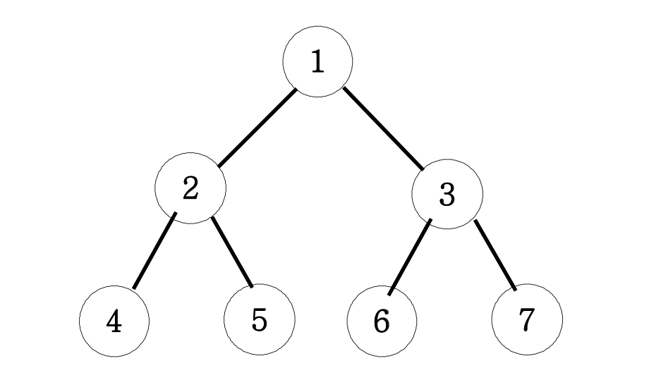

## 문제 설명

아래 그림과 같은 이진트리를 전위순회와 후위순회를 연습해보세요.

<br> 
<br>
<br>

## 입력/출력 예제

| 종류     | 출력          |
| -------- | ------------- |
| 전위순회 | 1 2 4 5 3 6 7 |
| 중위순회 | 4 2 5 1 6 3 7 |
| 후위순회 | 4 5 2 6 7 3 1 |

<br>
<br>

## 내 답안

```js
function solution(n) {
    function DFS(v) {
        if (v > 7) return;
        else {
            console.log(v);
            DFS(v * 2);
            DFS(v * 2 + 1);
        }
    }
    DFS(n);
}

solution(1);
```

-   전위순회 구현
-   console.log의 위치에 따라 전위, 중위, 후위 순회를 구현할 수 있다.

<br>
<br>

## 새로 학습한 내용

-   DFS(Depth First Search, 깊이 우선 탐색)
    -   깊이를 우선적으로 탐색하는 알고리즘
-   이진트리
    -   부모 노드에서 자녀노드로 뻗어나가는 구조
    -   왼쪽 자녀: (부모 노드) \*2, 오른쪽 자녀: (부모 노드) \*2+1
-   순회
    -   부모를 출력하는 위치에 따라 전위/중위/후위 순회로 구분된다.
    -   전위순회 출력: 부모, 왼쪽 자녀, 오른쪽 자녀 순으로 출력<br>
        중위순회 출력: 왼쪽 자녀, 부모, 오른쪽 자녀 순으로 출력<br>
        후위순회 출력: 왼쪽 자녀, 오른쪽 나여, 부모 순으로 출력
