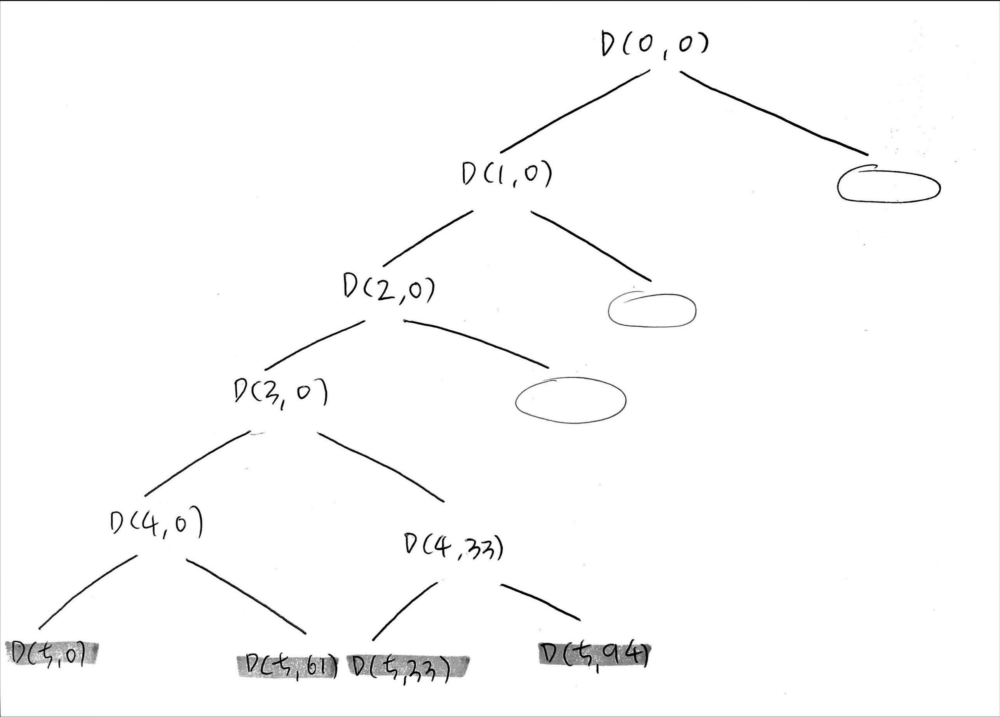

## 문제 설명

철수는 그의 바둑이들을 데리고 시장에 가력고 한다. 그런데 그의 트럭은 C킬로그램 넘게 태울수가 없다. 철수는 C를 넘지 않으면서 그의 바둑이들을 가장 무겁게 태우고 싶다.<br />
N마리의 바둑이와 각 바둑이의 무게 W가 주어지면, 철수가 트럭에 태울 수 있는 가장 무거운 무게를 구하는 프로그램을 작성하세요.<br />

<br />
<br />

## 입력/출력 예제

| 입력                      | 출력 |
| ------------------------- | ---- |
| 259, [81, 58, 42, 33, 61] | 242  |

<br />
<br />

## 내 답안

```js
function solution(C, arr) {
    let answer = 0;
    let n = arr.length;
    function DFS(N, sum) {
        if (N === n) {
            if (sum <= C && sum > answer) {
                answer = sum;
            }
        } else {
            DFS(N + 1, sum);
            DFS(N + 1, sum + arr[N]);
        }
    }
    DFS(0, 0);
    return answer;
}
let arr = [81, 58, 42, 33, 61];
console.log(solution(259, arr));
}
```

-   D(5)에 도달했을 때 sum의 크기가 무게 C의 크기보다 크지 않은지 확인하고, 크지 않은 것이 확인되면 변수 answer의 값과 비교하여 더 큰 값으로 갱신한다.
    </br>
    

  </br>  
  </br>

## 모범답안

```js
function solution(c, arr) {
    let answer = Number.MIN_SAFE_INTEGER;
    let n = arr.length;
    function DFS(L, sum) {
        if (sum > c) return;
        if (L === n) {
            answer = Math.max(answer, sum);
        } else {
            DFS(L + 1, sum + arr[L]);
            DFS(L + 1, sum);
        }
    }
    DFS(0, 0);
    return answer;
}

let arr = [81, 58, 42, 33, 61];
console.log(solution(259, arr));
```

-
