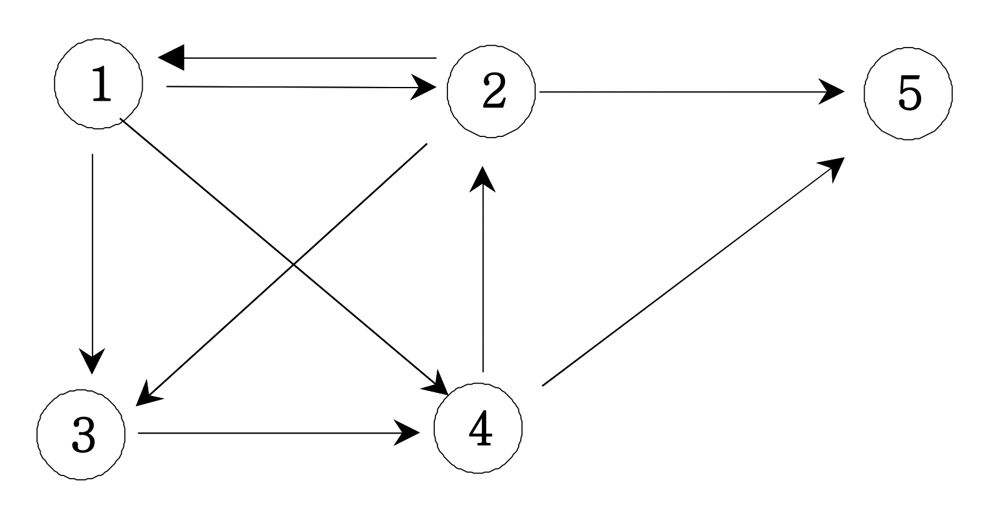

## 문제 설명

방향그래프가 주어지면 1번 정점에서 N번 정점으로 가는 모든 경로의 가지 수를 출력하는 프로그램을 작성하세요. 아래 그래프에서 1번 정점에서 5번 정점으로 가는 가지수는 총 6가지 입니다. </br>
<br>

<br>
자연수 N과 배열이 입력됩니다.

<br />
<br />

## 입력/출력 예제

| 입력   | 출력 |
| ------ | ---- |
| 5, arr | 6    |

<br />
<br />

## 모범답안

```js
function solution(n, arr) {
    let answer = 0;
    let graph = Array.from(Array(n + 1), () => Array(n + 1).fill(0));
    let ch = Array.from({ length: n + 1 }, () => 0);

    // 순회방법 1
    // arr.forEach(([a, b]) => {
    //     graph[a][b] = 1;
    // });

    // 순회방법 2
    for (let [a, b] of arr) {
        graph[a][b] = 1;
    }

    function DFS(v) {
        if (v === n) {
            answer++;
        } else {
            for (let i = 1; i <= n; i++) {
                if (graph[v][i] === 1 && ch[i] === 0) {
                    ch[i] = 1;
                    DFS(i);
                    ch[i] = 0;
                }
            }
        }
    }
    ch[1] = 1;
    DFS(1);
    return answer;
}

let arr = [
    [1, 2],
    [1, 3],
    [1, 4],
    [2, 1],
    [2, 3],
    [2, 5],
    [3, 4],
    [4, 2],
    [4, 5]
];
console.log(solution(5, arr));
```

<br />
<br />

## 새로 학습한 내용

-   인접 행렬: 그래프의 연결 관계를 이차원 배열로 나타내는 방식
