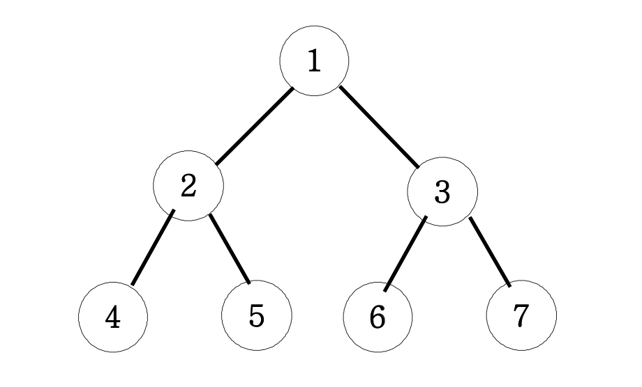

## 문제 설명

아래 그림과 같은 이진트리를 넓이우선탐색해 보세요.
<br>

<br>
위의 지도에서 출발점에서 도착점까지 갈 수 있는 방법의 수는 8가지이다.

<br />
<br />

## 입력/출력 예제

| 입력 | 출력          |
| ---- | ------------- |
|      | 1 2 3 4 5 6 7 |

<br />
<br />

## 내 답안

```js
function solution() {
    let answer = "";
    let queue = [];
    queue.push(1);
    while (queue.length) {
        let v = queue.shift();
        answer += v + " ";
        for (let nv of [v * 2, v * 2 + 1]) {
            if (nv > 7) continue;
            queue.push(nv);
        }
    }
    return answer;
}

console.log(solution());
```

<br />
<br />

## 새로 학습한 내용

-   BFS(Breadth First Search, 넓이우선탐색)
    -   시작 정점부터 시작해서 인접한 모든 정점들을 우선 방문하는 방법
