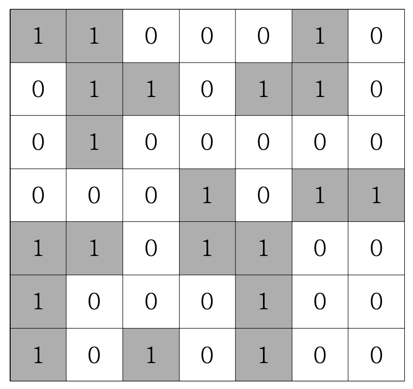

## 문제 설명

N\*N의 섬나라 아일랜드의 지도가 격자판의 정보로 주어집니다. 각 섬은 1로 표시되어 상하좌 우와 대각선으로 연결되어 있으며, 0은 바다입니다. 섬나라 아일랜드에 몇 개의 섬이 있는지 구하는 프로그램을 작성하세요.

<br>


<br />
<br />
<br />

## 입력/출력 예제

| 입력  | 출력 |
| ----- | ---- |
| board | 5    |

<br />
<br />

## 내 답안

```js
function solution(board) {
    let answer = 0;
    let n = board.length;
    let dx = [-1, -1, 0, 1, 1, 1, 0, -1];
    let dy = [0, 1, 1, 1, 0, -1, -1, -1];

    function DFS(i, j) {
        if (board[i][j] === 0) {
            return;
        } else {
            board[i][j] = 0;
            for (let k = 0; k < 8; k++) {
                let nx = i + dx[k];
                let ny = j + dy[k];
                if (nx >= 0 && nx < 7 && ny >= 0 && ny < 7) {
                    DFS(nx, ny);
                }
            }
        }
    }

    for (i = 0; i < n; i++) {
        for (j = 0; j < n; j++) {
            if (board[i][j] === 1) {
                DFS(i, j);
                console.log(i, j);
                answer += 1;
            }
        }
    }

    return answer;
}

let arr = [
    [1, 1, 0, 0, 0, 1, 0],
    [0, 1, 1, 0, 1, 1, 0],
    [0, 1, 0, 0, 0, 0, 0],
    [0, 0, 0, 1, 0, 1, 1],
    [1, 1, 0, 1, 1, 0, 0],
    [1, 0, 0, 0, 1, 0, 0],
    [1, 0, 1, 0, 1, 0, 0]
];

console.log(solution(arr));
```

-   북, 북동, 동, 남동, 남, 남서, 서, 북서 순으로 탐색한다.

<br />
<br />

## 모범답안

```js
function solution(board) {
    let answer = 0;
    let n = board.length;
    let dx = [-1, -1, 0, 1, 1, 1, 0, -1];
    let dy = [0, 1, 1, 1, 0, -1, -1, -1];

    function DFS(i, j) {
        board[i][j] = 0;
        for (let k = 0; k < 8; k++) {
            let nx = i + dx[k];
            let ny = j + dy[k];
            if (nx >= 0 && nx < n && ny >= 0 && ny < n && board[nx][ny] === 1) {
                DFS(nx, ny);
            }
        }
    }

    for (i = 0; i < n; i++) {
        for (j = 0; j < n; j++) {
            if (board[i][j] === 1) {
                DFS(i, j);
                console.log(i, j);
                answer += 1;
            }
        }
    }

    return answer;
}
let arr = [
    [1, 1, 0, 0, 0, 1, 0],
    [0, 1, 1, 0, 1, 1, 0],
    [0, 1, 0, 0, 0, 0, 0],
    [0, 0, 0, 1, 0, 1, 1],
    [1, 1, 0, 1, 1, 0, 0],
    [1, 0, 0, 0, 1, 0, 0],
    [1, 0, 1, 0, 1, 0, 0]
];

console.log(solution(arr));
```

-   DFS 함수를 더 간단하게 정리하였다.
